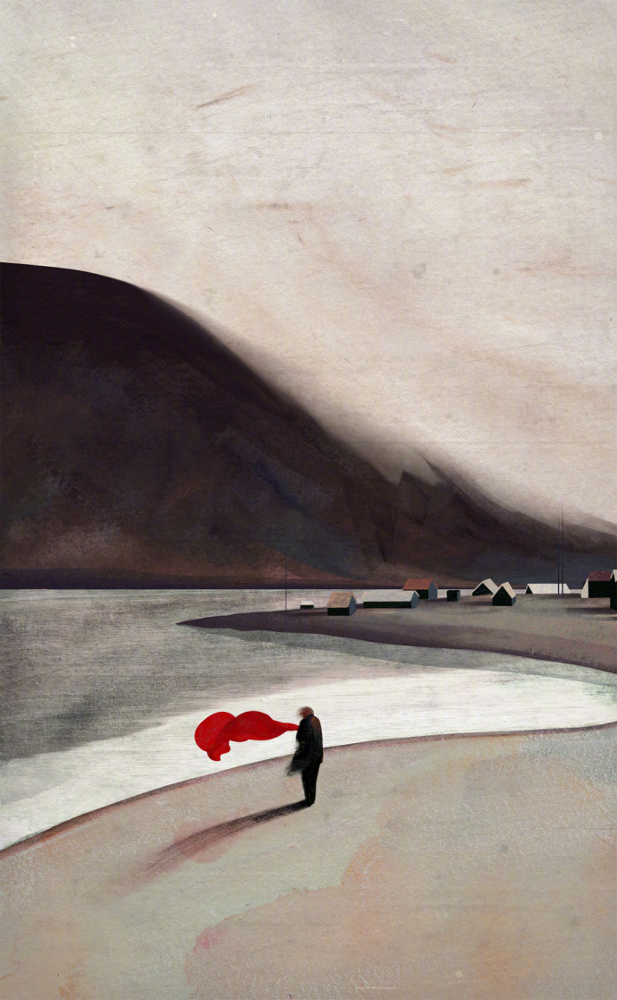
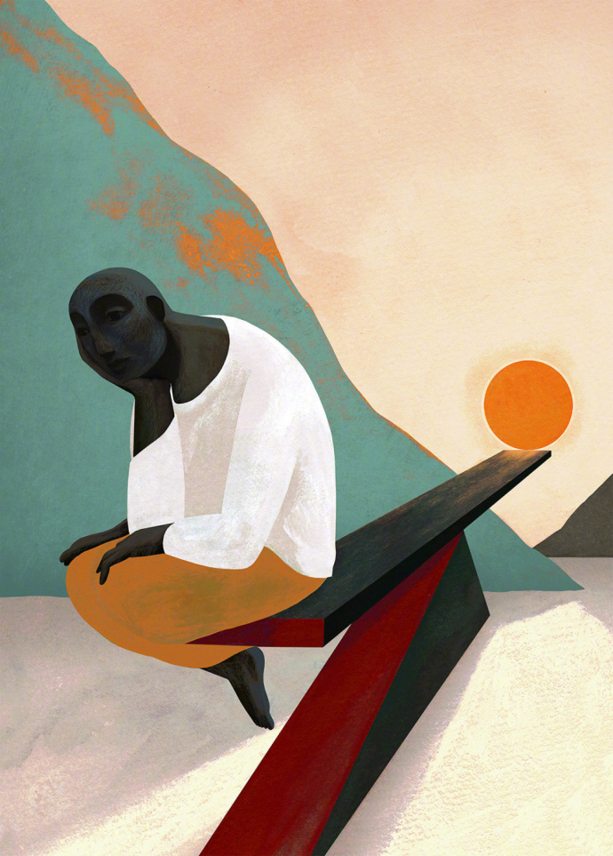
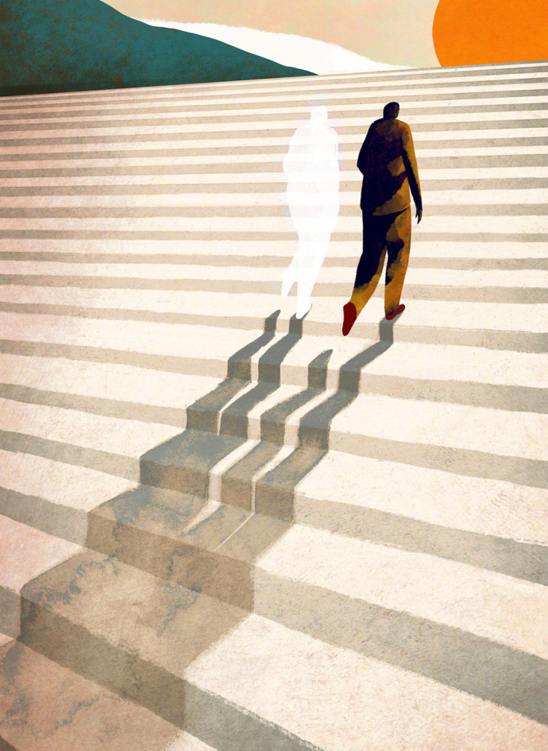
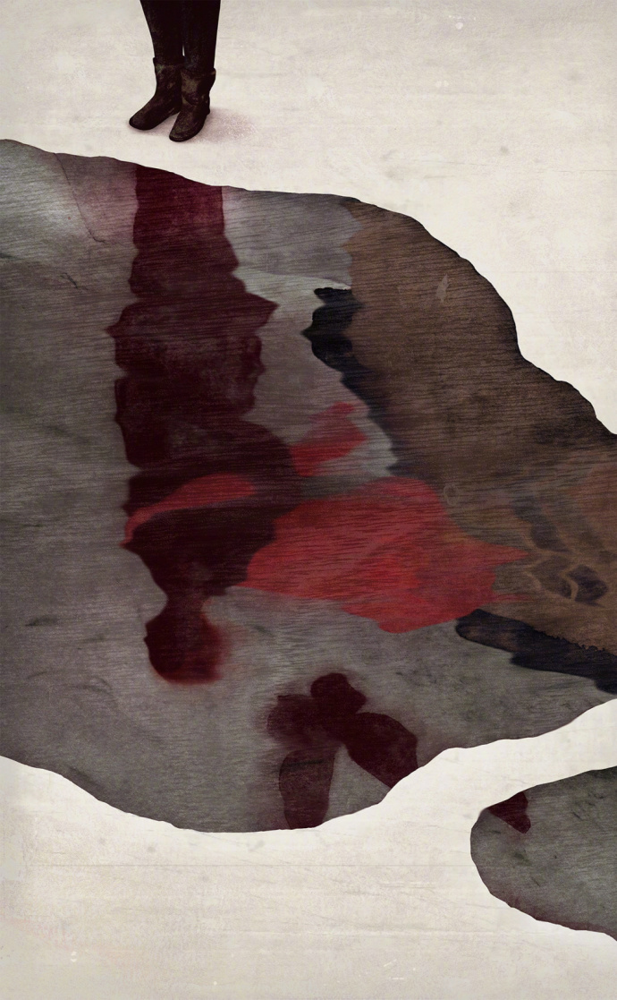

佛教与科学的时间观

------------------------------------------

随着时间的推移，佛教和科学达成一致，这是一个世事无常的世界——包括我们自己。

我还记得我爷爷带着一丝无可奈何的苦笑说，当他看见自己孩子到了中年，才发觉自己真的老了。那时候我还只是一个孩子，而现在我还未到中年的孩子已经有了他们自己的孩子。

成为孩子们的爷爷其实是件挺美好的事情，这是对生命延续的确证，又是正当生命本身不断地流向未来时在前沿对它的观察（甚至有时是亲身参与）。**但是衰老也是我们最不能否认的死亡象征，一个不是关于生的，而是关于人终有一死的提醒**。我祖父的死让我很害怕，此后，几乎没有什么事情能吓到我，除了一再出现的死亡意识（经常是在独自一人的黑夜）：**他的生命，每个人的生命，甚至是我自己的生命都是稍纵即逝的。**

所有的事物，尤其是有生命的，都浸在时间的河流中。从西方科学的视角我们看到并明白我们的身体会损耗并终将死去。**在死亡那里一切都走向终结，在向熵的最终投降中归于沉寂**。但还有另一种观点，它与科学惊人地相一致的，并以一种新的、甚至是让人安心的方式，帮助我们重新审视对时间那巨大而古老的恐惧——这就是由佛教提供的观点。

对于佛教徒来说，正如诗人叶芝(W.B. Yeats)所说的那样“**中心不能维系**”。因为它不是以一种严格地与所有事物相分离的方式存在，包括我们自己，没有什么是永恒不变的。试图依附于一个坚固的、不可改变的自我核心是一个愚蠢的错误，因为时间不仅造成了混乱，它还提供了不可被忽略的母体，在其中一切 —— 有生命的或没有生命的，有知觉的或无知觉的，都处于兴衰消长之中。

正如佛教徒理解的那样，所有的生物都是必然地和不可避免地，甚至是不可思议地，荣耀地，无常的。在梵语中“无常”一词是 anitya。理解无常是很重要的，因为它为现代西方科学与古老东方智慧的连接打开了一扇门。

维尔纳·海森堡Werner Heisenberg（现代量子物理学发展的领军人物之一）在他的《物理学与哲学》中写道:“**在人类历史上，最有成就的发展经常发生在两种不同思想交汇的地方。**”与拉迪亚德·吉卜林（Rudyard Kipling）的禁制令“东方是东方的，西方是西方的，两者永不会相遇”恰恰相反。作为一名专业的生物学家，我发现现代思想中一些最富有成就的发展恰恰发生在生物学和佛教交汇的地方。

**即使是看起来坚固而持久没有生命的物体，也被现代物理学揭示为处于不断变化的状态。一根铁棒大部分的空间是空的，甚至那些从表面上看来占据了空间的固体的亚原子粒子也不是静止的，它们要么移动得难以想象得快，要么是作为概率云而存在。**

有了生物，世界就更不稳定了。正如叶芝所言:“身体随着音乐摇摆，明亮的一瞥，我们怎么能从舞蹈中了解舞者?”生物学家和佛教徒都知道，活着的东西总是在“跳舞”，他（它）们从非生命的成分中创造出来，并不断地再生。**每时每刻我们的存在只发生在转瞬即逝、悬而未决的当下，这个当下永远无法被捕捉，亦无法保持静止。**

佛陀在年轻的时候试图克服真实世界的不完美——疾病、衰老和死亡，他曾遵照传统印度教禁欲主义的道路，折磨着肉体，几乎让自己饿死。然而，据说他最终开悟是因为承认了所有的事物都是暂时的、不断变化的、无常的。和承诺永生的基督不一样，据说佛陀临终遗言的第一句是，**“衰变是万物内在的本质。”**

但即使是衰变，这个时间影响现实世界而产生的不可避免的结果，也不是什么令人遗憾之事。正如越南佛教僧侣和学者Thich Nhat Hanh所说，无常是与连续性密切相关的。 “回头看，”他说：“你会发现你不仅存在于你的父母中，你的祖父母和曾祖父母中也有你。”再看一遍，你会发现我们“一直在气体、阳光、水、真菌和植物中，”他写道。“没有什么能出生，也没有什么能死亡。”**从我们的骨子里明白并理解这一点，可能永远改变我们的时间观念和参与世界上的生命所具有的意义。**

时间是如何揭示及产生了无常，每一个身体中又如何体现了无常，衰老无疑是对这些问题最明显和最不可被忽视的说明。确切地说，身体如何老化属于生物老年学领域，这个领域所研究的项目有细胞突变的不断积累、组织弹性的减弱、自身免疫应答的增强，以及端粒的减少长度（端粒是染色体末段，它好比是鞋带末端的塑料头，并且它显然在染色体经历细胞分裂时保护染色体）。大多数的人类细胞在大约60次复制后就会丧失活力，这显然是与端粒的丢失一起发生的。这些端粒在每一回的有丝分裂中变得更短一些——尽管目前还不清楚与年龄相关的衰老是由这种端粒减少导致的，或是相反。

无论因果序列是什么，都不存在青春的源泉。我们可以通过吃健康的食物，减少压力，经常锻炼来降低衰老的速度。**但这效果最多也只是减缓整个过程，而不是完全使它停止。成为一名博物馆管理员、运动狂热者，或者仅仅一个每天使用牙线的人更像是成为西西弗斯而不是庞塞德莱昂。**

但这太悲观了。一种佛教的观点认为，即使一切都随着时间而改变，这种不持久也与一种更深层次的持久性有关。其中一个更引人注目的视觉展示是在西藏的僧侣们建造华丽的沙制曼陀罗，复杂的设计和图案是许多天精心建造的结果，之后他们会被隆重地一扫而空。曼陀罗是我们自己的代表，象征着一切的无常，不管这些事物多么美好、多么复杂、多么珍贵、多么重要。

几年前，我在世德罗伍利(Sedro Woolley)小镇的一个森林服务管理处等待荒野许可证的时候，无意中听到一个护林员发来的无线电信息:“艾格尼丝河上的死麋鹿很好地腐烂了，结束了。” 护林员在生态学上颇有见地，并且在佛教的意义上是正确的。尽管麋鹿的腐烂可能不是所有人都会觉得好，但这个过程对于一个健康的生态系统来说是必不可少的，因为它是不可避免的。(**“结束了”是一个特别好的细节。**)

另一个生物学上无常的例子是著名的多莉，它推翻了之前生物法则，是世界上第一个被人工克隆的绵羊。在多利羊之前，人们普遍认为一旦脊椎动物细胞完全分化，比如变成了肌肉或皮肤，或者是多莉的“妈妈”，即乳腺组织，就会永久固定，不能变成另一种细胞。

多利羊是在一个无核卵细胞中植入进一个已经分化的细胞核创造出来的，一个新的动物出现了，其具有一系列完整的明显不同的细胞类型。细胞分化显然不像以前认为的那样是一条单行道。**具有讽刺意味的是，构成生命本身的一件事就是无常和改变能力。**

无常的真实性延伸到整个基因组，它可被来自其他细胞系的基因所渗透。这就是为什么我们可以将来自大比目鱼的冷抗性基因放入易受霜冻的番茄中。(我们是否应该则是另一个问题。)即使没有人类高科技的干预，所有生物之间的连续性的进化现实是与所有世系都发生了进化的事实密不可分的。也就是说，它们随着时间的推移已经发生了改变，并将持续变化下去。细胞之间和物种之内看似严格的界限实际上是灵活的和不稳定的。生物不是简单地拥有无常的特性；而是，在可被我们悖论地称作它们的“核心”处，它们的无常和永恒变动是彻底而深刻的。

那么完整的生物体呢?毕竟，每一个大比目鱼、山核桃树，或人类，在时间中似乎都是不同的、固定的—或者至少可以辨认为这个物体，这个生物，这个人。**但是，每一个“这个”很大程度上都是我们对时间和其影响的有限认知的人造产物。等待足够长的时间，让时间有机会以它的方式去运作，每一个有生命的事物都在发生变化，经历着胚胎发育，生长，衰老，最终死亡。简而言之，时间会证明一切。**

问:当一个尼姑去美容院时，她可能会得到什么?答: 无常。

尽管如此，有生命的事物似乎都在努力地对抗无常，抗拒改变。生理学家的专业术语是**“内稳态”**，即有机体在一定范围内保持内部环境平衡的过程。这一点在哺乳动物身上尤为明显，它们有各种各样的适应能力，以确保它们的内部温度与外界环境无关。然而，至少同样重要的是内部的化学环境:不过度呈酸性，不过度呈碱性，有足够的钠，钾和钙。如果没有精确稳定的金发平衡（Goldilocks balance，指恰到好处，刚刚好的意思，译者注），生命就会停止。

从狭义上讲，这是对无常的公然抗拒。但是，生命所需要的生理稳定性只能在物理学家们所称的“开放系统”中实现，即从其他地方有规律地获得能量和物质的输入。**就生物而言，这意味着即使是暂时的，似乎对无常的抗拒，也只能通过不断地引进新物质来实现。在短期内，这意味着携带能量的分子能够呼吸和新陈代谢;从更长远的角度来看，这意味着蛋白质和其他涉及生长、维持和修复的物质。**

矛盾的是，保持一个明显的恒常性状态(也就是生命)需要对变化保持持续的开放，在这个例子中是与一个有机体的环境进行交换。当交换停止时，生命也停止了；尽管，即使到那时，每一个身体都在继续发生变化，无论是通过分解，还是进入另一个身体，或者是焚烧。回想一下，麋鹿正在经历它的强制性改变，真是太好了。

让我们细思一下处于一个更早、更活跃的状态的麋鹿——或我们自己，看看对我们称之为“活着”的状态极为必要的两种现象:呼吸和消化，或新陈代谢。我们经常吸入大约半升的空气，相对较高的氧气含量和低的二氧化碳含量。我们的身体将一些氧气与我们早期消耗的食物分子结合在一起，以产生能量。我们随后呼出的半升气体含有更少的氧气和更多的二氧化碳，这是新陈代谢的副产品。“新的”原子每时每刻都融入到我们的身体中，“旧”的原子被重新排列，而有些则被挤出来。每隔几天，我们就会从本质上更新自己，让人想起以前的一首牛奶的广告歌，“每天你都是一个新的自己!”**除了实际它更像是每小时、每分钟、每秒、每瞬间。**

当然还有造就了所有生命并且构成它们基础的进化。进化就是改变——随时间变化而改变血统成分。虽然某些生物体已经进化得很快(人类、大象、细菌)，但其他生物却进展缓慢。它们包括一些奇特的生物，如腔棘鱼(鳍鱼类，在1930年一条腔棘鱼在马达加斯加深海处被捕获之前，人们以为它灭绝了),大蜥蜴(特殊的蜥蜴，只在新西兰海岸的几个岛屿发现),或马蹄型的“螃蟹”( 与蜘蛛关系密切，并且在几亿年间并未发生显著的变化）。但与它们柔软的前寒武纪祖先相比，即使是这些“活化石”也已经进化了，也就是说，它们也随着时间的推移而改变，正如当他们在环境变化时，它们将会继续进化或者灭绝。

那基因本身呢?它们难道不是固定不变的而非短暂的吗?理查德•道金斯(Richard Dawkins)在他的书《自私的基因》中有效推广了这种观点：身体只是，为了基因的利益而由它们的组成基因所构建的临时结构。**身体里充满了无常，它们转瞬即逝，然而基因却能始终持存，它们成为后代子孙或者进入其他亲人的身体里，以此被延续于未来。道金斯的书的有一章名为“不朽的线圈”。**

虽然基因的潜在不朽是一个有效的比喻，但并不完全正确。生物学家们知道，一些基因特征是“高度保守的”，这意味着它们不太可能随着时间的推移而改变。这些包括那些基本的细胞内活动的指令，如能量如何来源于碳氢化合物分子，以及将核酸转化成蛋白质的编码系统。这些基因在几代人之间准确复制的精确度是惊人的，但也不足为奇，因为错误会在基本过程中很快被剔除，使得没有改变的部分能存留下来。

但突变的发生说明这不是永远不变的。平均来说，基因突变的频率约为在每一百万次复制中发生一次。如果有足够的时间，错误是不可避免的。考虑到环境的变化，有利的突变被挑选出来，而有害的突变则被淘汰。所有人最终的和不可避免的死亡被萨默塞特·毛姆(w . Somerset Maugham) 戏剧性地表述为“萨迈拉的任命”。**即使是基因也不能逃避与无常的约会。**

大多数突变是由不正确的碱基配对引起的，包括四种关键的遗传分子:腺嘌呤(A)、胞嘧啶(C)、胸腺嘧啶(T)和鸟嘌呤(G)，当意外发生时，它们不能按照A 和 T和C 和G的正常模式排列。相比之下，DNA异常坚硬的螺旋骨架——由它产生了双螺旋结构——是由重复的核糖和磷酸基构成的，它要比碱基配对稳定得多，因为前者依赖于“常规的”化学键而后者则是通过更弱“氢键”来实现的。

但即使是在这里，改变也是不可避免的，尽管可能不那么重要。在DNA分子中无处不在的氢原子不断地与周围的氢原子交换位置,由此产生的“氢交换”已经被证明，以保证即使是一个非突变的DNA分子也会改变形状，即使它表面看起来是静止的。所以即使是可能不朽的DNA中最稳定的成分，也被无常渗透着，不断地重塑自己。

禅宗公案是一些谜题，旨在摆脱对线性思维过程的过度依赖。有一个著名的公案，要求一位沙弥尼描述她出生之前的脸。**现在的一个好答案可能与DNA有关，但它也必须包含消长，程序和模式，偶然性和可能性，无常的一个自相矛盾的永恒状态。**

随着时间的推移，无常表现在许多不同的层次上：生物地球化学循环的生态变迁，不可避免的从出生到衰老到死亡的转变，以及有机体的所有部分的瞬时转变。**我们对持久不变性的幻觉可能是由我们持续的记忆培养来的，但现在心理学家明白，记忆不仅是经常不正确的，而且如同我们身体的物质一般在不断变化的。**

从科学的角度来看，生物学家有充分的理由与佛教徒一起拒绝被后者称为“自性“的，固定不变的本质。**在我们最深处，分子水平上，我们没有本质。**“时间是构成'我'的实体”豪尔赫·路易斯·博尔赫斯写道。**“时间是一条河流，它毫不费力地将我冲走，但我就是那条河流；它是一只吞噬我的老虎，但我就是那头老虎；这是一场毁灭我的火，但我就是那场火。”**

在东方神话中，有个故事讲述的是一位国王把他的智囊团召集在一起，要求他们给出一个对于所有活的事物在任何时候都为真的一个论述。最终他们一致同意这句话:“这也将过去。”无常的通用配方正如其不可避免性那样是简单：**从世界上的原料开始，然后浸泡在时间的陈迹之中。**

当爱丽丝·门罗获得2013年诺贝尔文学奖时，《纽约时报》的一篇社论指出，作家“她可以对时间做任何她想做的事情，加速它，删除它，让它慢下来。但当我们放下这个故事的时候，时间已经发生在我们身上了。”我祖父最能强烈地感受到时间正发生在他身上，当他看到时间对周围人的影响，尤其那些他所爱的人，他们比他年轻得多、时间理应在他们身上留下更少的痕迹。

**但是，真理当然是：每时每刻我们所有人都在经历时间。佛法有助于我们理解、甚至是陶醉于作为结果的无常。**

>作者介绍：
>大卫p.巴拉什 是华盛顿大学的进化生物学家和心理学教授，选自他最近出版的书《佛教生物学:古代东方智慧与现代西方科学》(牛津大学出版社)。

>插图：
>Owen Gent 英国插画家，Uncle Ginger 动画工作室指导，曾为纽约客，时尚等知名杂志做插画。

>翻译：
>又见镜子Hannah ，自由职业，素食主义＋环保主义＋手账er，荡过米国和东南亚友好联邦。
>孟溪，不务正业的哲学系毕业生，目前从事新闻行业。
